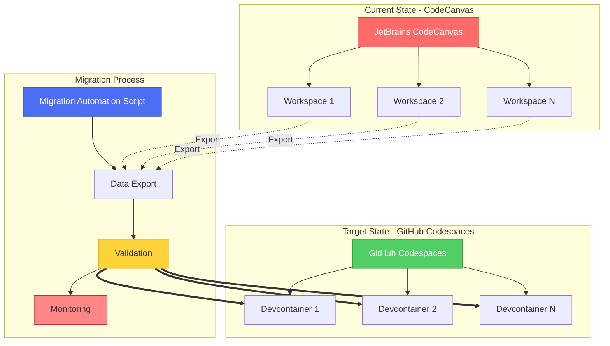
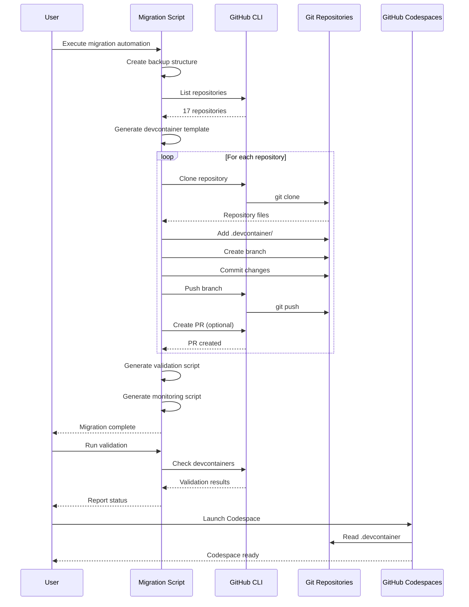
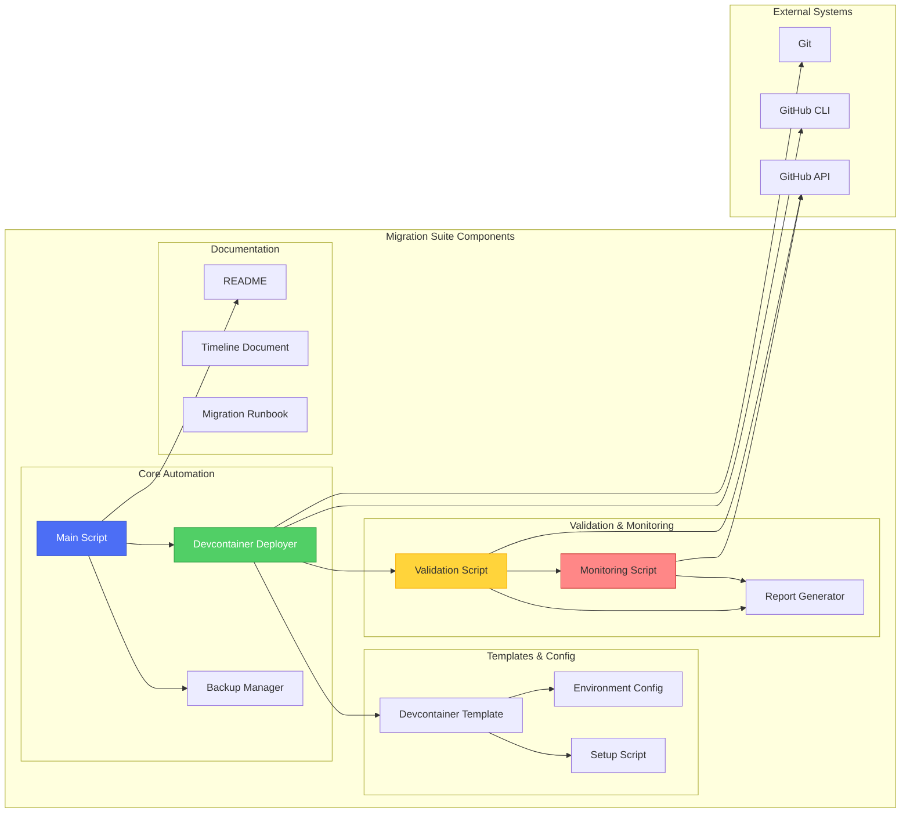
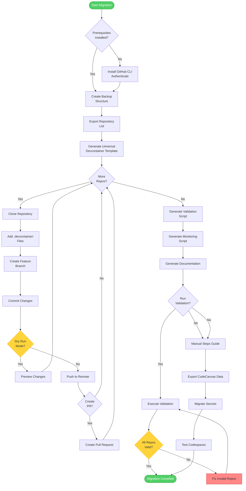
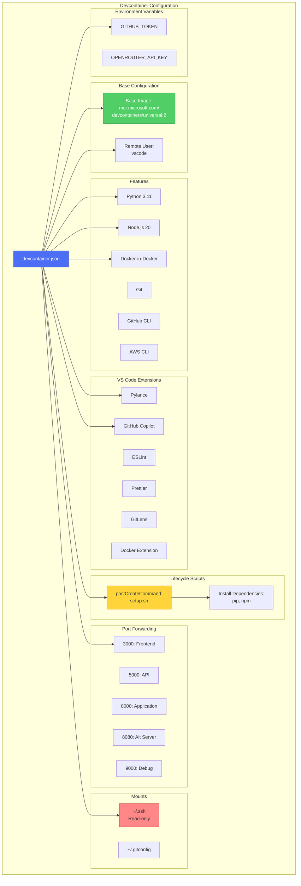
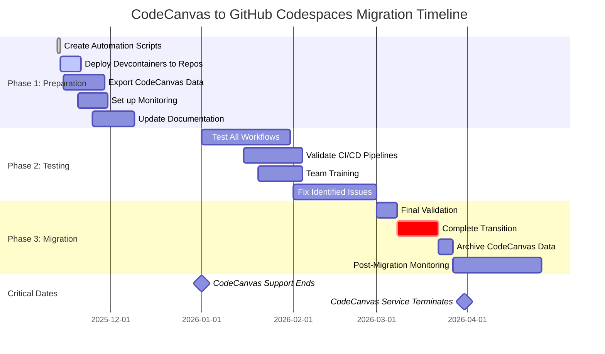
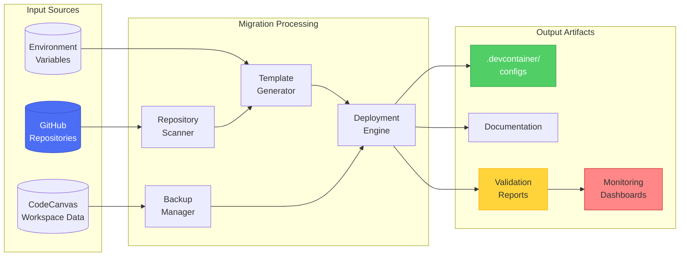
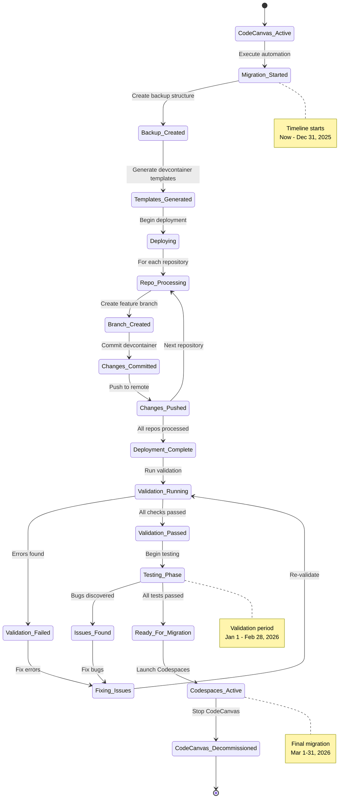
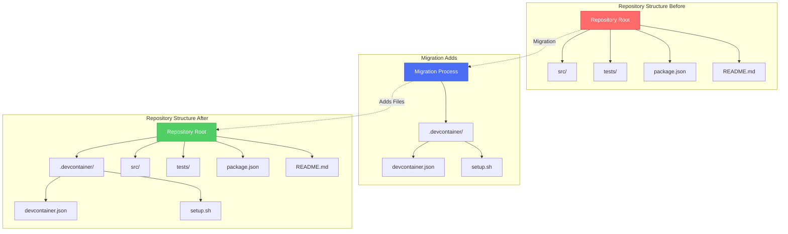
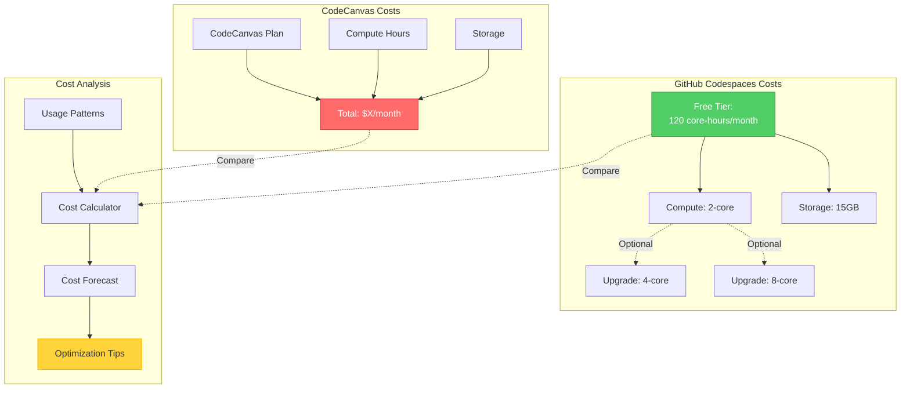

# CodeCanvas to GitHub Codespaces Migration - Architecture Diagrams

## 1. High-Level Migration Architecture

## 2. Migration Automation Sequence Diagram

## 3. Component Architecture Diagram

## 4. Migration Workflow Flowchart

## 5. Devcontainer Configuration Structure

## 6. Timeline and Phases

## 7. Data Flow Diagram

## 8. System State Diagram

## 9. Repository Migration Pattern

## 10. Cost Comparison Architecture

---

## Diagram Descriptions

### 1. High-Level Migration Architecture
Shows the complete migration path from CodeCanvas workspaces to GitHub Codespaces devcontainers, including the intermediary migration process.

### 2. Migration Automation Sequence
Detailed sequence showing interactions between user, migration script, GitHub CLI, and repositories during the automated deployment process.

### 3. Component Architecture
Breaks down the migration suite into logical components including core automation, templates, validation, and documentation modules.

### 4. Migration Workflow Flowchart
Step-by-step decision tree showing the complete migration workflow including validation, dry-run modes, and error handling.

### 5. Devcontainer Configuration Structure
Hierarchical view of the devcontainer.json structure showing all features, extensions, ports, mounts, and environment variables.

### 6. Timeline and Phases
Gantt chart showing the three-phase migration timeline with critical milestones (January 1 and March 31, 2026).

### 7. Data Flow Diagram
Shows how data flows from input sources (repos, CodeCanvas data, environment) through processing to output artifacts.

### 8. System State Diagram
State machine representation of the migration process from CodeCanvas active state through to Codespaces deployment.

### 9. Repository Migration Pattern
Before/after view showing how the migration process adds .devcontainer/ directory to existing repository structure.

### 10. Cost Comparison Architecture
Visual comparison of CodeCanvas costs vs GitHub Codespaces costs with optimization recommendations.

---

## Usage

These diagrams can be rendered in:
- **GitHub**: Automatically renders Mermaid in markdown files
- **VS Code**: Install Mermaid Preview extension
- **Documentation Sites**: Most support Mermaid (GitBook, Docusaurus, etc.)
- **Mermaid Live Editor**: https://mermaid.live for editing and export

## Next Steps

1. Review diagrams with stakeholders
2. Include in migration documentation
3. Use for team training sessions
4. Reference during migration execution
5. Update as migration progresses

---

🤖 Generated with Claude Code - CodeCanvas Migration Suite
